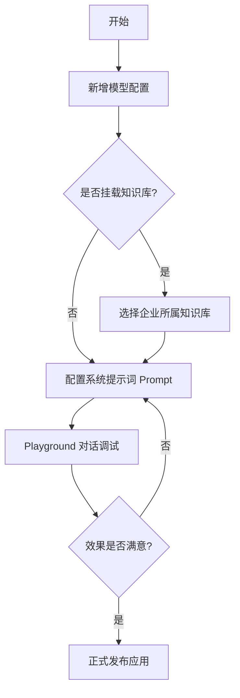

# 智能机器人配置管理平台 (Bot-Config-Admin) 产品需求文档 (PRD)

| 版本 | 修订日期 | 修订内容 | 负责人 | 状态 |
| :--- | :--- | :--- | :--- | :--- |
| v1.0 | 2024-03-10 | 初始版本编写 | Antigravity | 已发布 |
| v1.1 | 2024-03-17 | 增加用量统计、性能监控及深度规格优化 | Antigravity | 已发布 |
| v1.2 | 2024-03-19 | 新增文档 AI 分析对话功能 | Antigravity | 已发布 |

## 1. 项目概述
### 1.1 项目背景
在企业数字化转型中，AI 能力的集成已成为核心竞争力。然而，不同模型供应商（OpenAI, Anthropic 等）的参数差异、企业内部私有知识库（RAG）的挂载管理以及模型效果的实时评估，给运营和开发带来了巨大挑战。本项目旨在打造一个集成化、可视化的“AI 中枢”，实现模型配置、知识挂载、对话调试及数据监控的全生命周期管理。

### 1.2 核心目标
- **标准化**：统一不同 LLM 供应商的接口与配置参数。
- **业务资产化**：将企业文档转化为可被 AI 检索的数字化知识库。
- **可观测性**：提供实时的用量统计与性能指标监控。

---

## 2. 角色与权限矩阵 (RBAC)

| 功能模块 | 超级管理员 (Admin) | 业务运营 (Operator) | 开发者 (Developer) |
| :--- | :---: | :---: | :---: |
| 模型配置 | 读/写 | 只读 | 读/写 |
| API Key 管理 | 读/写 | - | - |
| 企业主体管理 | 读/写 | 读/写 | - |
| 知识库上传/索引 | 读/写 | 读/写 | - |
| 统计与监控看板 | 读/写 | 读 | 读 |
| AI 对话调试 | 读/写 | 读/写 | 读/写 |

---

## 3. 核心业务流程

### 3.1 模型配置与挂载流程

---

## 4. 功能规格详述

### 4.1 模型管理与参数语义化
- **描述**：通过抽象层隐藏底层 API 差异，提供语义化的参数调节（如“创造力”对应 Temperature）。
- **业务规则**：
    - API Key 必须加密存储且前端脱敏展示。
    - 修改关键参数需记录版本审计日志。
- **验收标准**：支持至少 3 种主流模型供应商，参数实时下发成功率 > 99.9%。

### 4.2 知识库 (RAG) 引擎
- **描述**：支持文档上传、切片、向量化及召回。
- **限制条件**：单文件大小不超过 50MB，支持 PDF/TXT/MD 格式。
- **关键指标**：向量搜索首包延迟（TTFT） < 500ms（在 10 万级 Chunk 下）。

### 4.3 统计报表 (已实现 v1.1)
- **核心逻辑**：实时汇聚各模型请求的 Token 消耗，支持按日/按企业聚合。
- **预警机制**：支持设置 Token 消耗阈值，达到 80% 时发送飞书/钉钉通知。

### 4.4 性能监控中心 (已实现 v1.1)
- **延迟分布**：按 25/50/75/90 分位数展示 TTFT 延迟。
- **Bad Case 闭环**：支持将对话中的负面反馈一键转为 Prompt 优化看板的任务项。
+
+### 4.5 文档 AI 分析对话 (新 v1.2)
+- **描述**：通过上传 PDF/Word 等文档，让 AI 结合文档内容进行专业解答。
+- **界面交互**：
+    - **三段式布局**：左侧历史会话、中间对话区、右侧原文预览。
+    - **实时解析**：支持上传后的进度实时展示。
+- **业务规则**：
+    - 问答结果必须标注来源（如：“基于文档第 X 页...”）。
+    - 历史会话按文档维度进行隔离。
+- **验收标准**：文档上传与解析耗时均值 < 5s，分栏布局在主流分辨率下无遮挡。

---

## 5. 非功能性需求 (NFR)

### 5.1 安全性
- **数据隔离**：确保多租户环境下，企业 A 无法通过 API 越权访问企业 B 的知识库文件。
- **鉴权**：系统应支持基于 JWT 的访问令牌，关键操作需二次 MFA。

### 5.2 性能
- **高并发**：管理后台支持 50 名管理员同时在线配置，不影响前端接口响应。
- **图表渲染**：大数据量下 ECharts 渲染延迟应控制在 300ms 以内。

### 5.3 稳定性 (SLA)
- **可用性**：系统年均可用率目标 99.95%。
- **容错性**：当某一模型供应商 API 宕机时，核心网关应具备自动切换备用模型的能力。

---

## 6. 数据模型 (ER 核心实体)

- **Organization (企业)**: `id, name, quota_limit`
- **ModelConfig (模型配置)**: `id, org_id, provider, params_json, system_prompt`
- **KnowledgeBase (知识库)**: `id, org_id, storage_url, vector_status`
- **CallLog (调用日志)**: `id, model_id, tokens_used, latency, user_feedback`

---

## 7. 路线图 (Roadmap)
- **Q1-P0**：完善模型配置持久化及知识库文件解析逻辑 (已完成)。
- **Q1-P1**：上线统计报表与性能监控 (已完成)。
- **Q1-P2**：推出文档 AI 分析对话功能 (已完成)。
- **Q2-P0**：企业级 RBAC 与多租户安全网关。
- **Q2-P1**：Prompt 版本控制系统与 A/B 测试。
