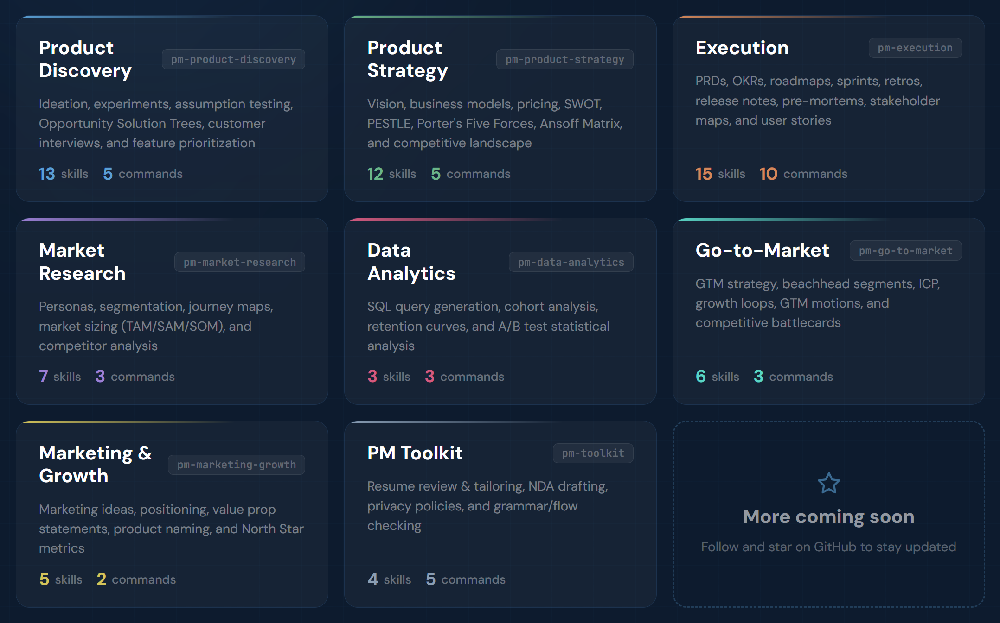
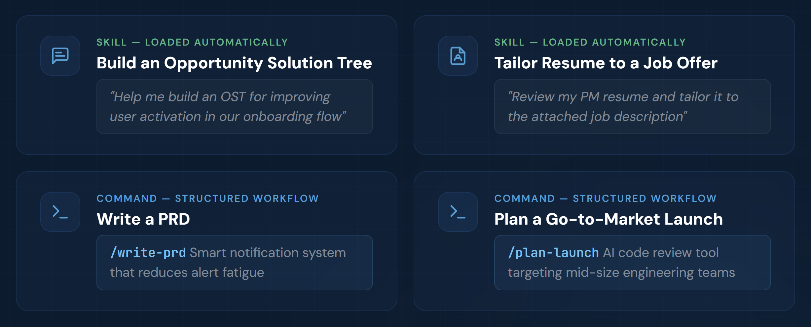
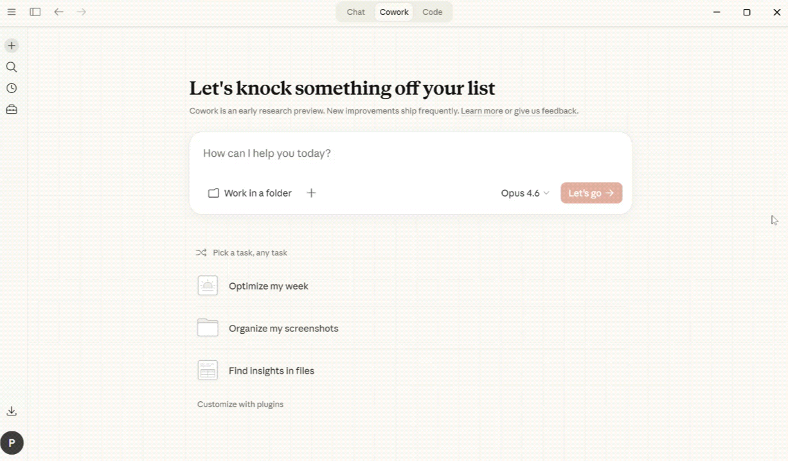

[](https://github.com/phuryn/pm-skills/blob/main/LICENSE)
[](https://github.com/phuryn/pm-skills/blob/main/CONTRIBUTING.md)

# PM 技能市场：助力更好产品决策的 AI 操作系统

> 涵盖 8 个插件中的 65 个 PM 技能和 36 个链式工作流。支持 Claude Code、Cowork 等。从需求发现到战略、执行、发布及增长的全流程覆盖。



专为 Claude Code 和 Cowork 设计。技能兼容其他 AI 助手。

## 快速开始

有新想法？ → `/discover`  
需要战略清晰化？ → `/strategy`  
编写 PRD？ → `/write-prd`  
规划发布？ → `/plan-launch`  
定义指标？ → `/north-star`

如果本项目对你有帮助，请给仓库点个 ⭐。

## 为什么选择 PM 技能市场？

通用的 AI 只能给你文字。PM 技能市场给你**结构**。

每个技能都编码了经过验证的 PM 框架——发现、假设映射、优先级排序、战略——并引导你一步步完成。你可以在日常工作流中获得 Teresa Torres、Marty Cagan 和 Alberto Savoia 等大师的严谨方法论，而不仅仅是让这些理论躺在书架上。

结果是：更好的产品决策，而不仅仅是更快地产生文档。

## 工作原理（技能、指令、插件）

**技能 (Skills)** 是市场的构建基块。每个技能为 Claude 提供特定 PM 任务的领域知识、分析框架或引导式工作流。有些技能还作为多个指令共享的可复用水准。

当与对话相关时，技能会自动加载——无需显式调用。如果需要（例如，优先使用技能而非通用知识），你可以通过 `/plugin-name:skill-name` 或 `/skill-name` **强制加载技能**（Claude 会自动添加前缀）。

**指令 (Commands)** 是用户触发的工作流，通过 `/command-name` 调用。它们将一个或多个技能链式组合成端到端流程。例如，`/discover` 串联了四个技能：头脑风暴构思 → 识别假设 → 假设排序 → 实验设计。

**插件 (Plugins)** 将相关的技能和指令分组为可安装的包。每个插件涵盖一个 PM 领域——发现、战略、执行等。安装市场将一次性获得所有 8 个插件。



指令使用技能。有些技能服务于多个指令。有些技能（如 `prioritization-frameworks` 或 `opportunity-solution-tree`）是独立参考，Claude 会在相关时随时提取——无需指令。

指令设计为互相流转，匹配 PM 工作流。任何指令完成后，它都会建议相关的后续指令——只需遵循提示即可。

## 安装

### Claude Cowork（针对非开发者的推荐方案）

1. 打开 **Customize**（左下角）
2. 前往 **Browse plugins** → **Personal** → **+**
3. 选择 **Add marketplace from GitHub**
4. 输入：`phuryn/pm-skills`

所有 8 个插件会自动安装。你将同时获得指令（`/discover`, `/strategy` 等）和技能。



### Claude Code (CLI)

```bash
# 步骤 1：添加市场
claude plugin marketplace add phuryn/pm-skills

# 步骤 2：安装各个插件
claude plugin install pm-toolkit@pm-skills
claude plugin install pm-product-strategy@pm-skills
claude plugin install pm-product-discovery@pm-skills 
claude plugin install pm-market-research@pm-skills 
claude plugin install pm-data-analytics@pm-skills
claude plugin install pm-marketing-growth@pm-skills
claude plugin install pm-go-to-market@pm-skills
claude plugin install pm-execution@pm-skills
```

### 其他 AI 助手（仅技能）

`skills/*/SKILL.md` 文件遵循通用技能格式，适用于任何读取该格式的工具。指令（`/slash-commands`）是 Claude 特有的。

| 工具 | 如何使用 | 支持内容 |
|------|-----------|------------|
| **Gemini CLI** | 将技能文件夹复制到 `.gemini/skills/` | 仅技能 |
| **OpenCode** | 将技能文件夹复制到 `.opencode/skills/` | 仅技能 |
| **Cursor** | 将技能文件夹复制到 `.cursor/skills/` | 仅技能 |
| **Codex CLI** | 将技能文件夹复制到 `.codex/skills/` | 仅技能 |
| **Kiro** | 将技能文件夹复制到 `.kiro/skills/` | 仅技能 |

```bash
# 示例：为 OpenCode 复制所有技能（项目级）
for plugin in pm-*/; do
  mkdir -p .opencode/skills/
  cp -r "$plugin/skills/"* .opencode/skills/ 2>/dev/null
done

# 示例：为 Gemini CLI 复制所有技能（全局）
for plugin in pm-*/; do
  cp -r "$plugin/skills/"* ~/.gemini/skills/ 2>/dev/null
done
```

---

## 可用插件

<details>
<summary><strong>1. pm-product-discovery</strong> —— 构思、实验、假设测试、OST、访谈（13 个技能，5 个指令）</summary>

**技能 (13):**

- `brainstorm-ideas-existing` —— 现有产品的多视角构思（PM、设计师、工程师视角）
- `brainstorm-ideas-new` —— 初始探索阶段新产品的构思
- `brainstorm-experiments-existing` —— 设计实验以测试现有产品的假设
- `brainstorm-experiments-new` —— 为新产品设计精益创业原型/模拟测试（Alberto Savoia）
- `identify-assumptions-existing` —— 识别价值、可用性、可行性及商业可行性维度的风险假设
- `identify-assumptions-new` —— 识别包括进入市场、战略、团队在内的 8 个类别的风险假设
- `prioritize-assumptions` —— 使用“影响 × 风险”矩阵排序假设并提供实验建议
- `prioritize-features` —— 基于影响、工作量、风险和战略一致性排序功能积压
- `analyze-feature-requests` —— 按主题和战略匹配度分析、分类客户功能请求
- `opportunity-solution-tree` —— 构建机会解决方案树（Teresa Torres）—— 结果 → 机会 → 方案 → 实验
- `interview-script` —— 创建带有 JTBD 探查问题的结构化客户访谈大纲
- `summarize-interview` —— 将访谈转录稿总结为 JTBD、满意度信号及行动项
- `metrics-dashboard` —— 设计包含北极星指标、输入指标及警报阈值的产品指标仪表盘

**指令 (5):**

- `/discover` —— 完整的发现循环：构思 → 假设映射 → 优先级排序 → 实验设计
- `/brainstorm` —— 多视角构思（`ideas|experiments` × `existing|new`）
- `/triage-requests` —— 分析并排序一批功能请求
- `/interview` —— 准备访谈大纲或总结转录稿（`prep|summarize`）
- `/setup-metrics` —— 设计产品指标仪表盘

**示例：**

技能：
- `我们关于 AI 写作助手的想法中，风险最高的假设是什么？`
- `帮我建立一个机会解决方案树，以提高用户激活率`
- `请排序这些来自企业客户的 12 个功能请求 [附带 CSV]`

指令：
- `/discover 面向远程团队的 AI 会议摘要工具`
- `/brainstorm experiments existing —— 我们需要减少注册流程中的流失`
- `/interview prep —— 我们正在访谈企业采购者，了解他们的采购流程`

</details>

<details>
<summary><strong>2. pm-product-strategy</strong> —— 愿景、商业模式、定价、竞争格局（12 个技能，5 个指令）</summary>

产品战略、愿景、商业模式、定价及宏观环境分析。涵盖从愿景塑造到竞争格局扫描的完整战略工具包。

**技能 (12):**

- `product-strategy` —— 全面的 9 模块产品战略画布（愿景 → 护城河）
- `startup-canvas` —— 结合产品战略（9 模块）+ 商业模式的创业画布 —— 针对新产品，是 BMC 和精益画布的替代方案
- `product-vision` —— 定义一个鼓舞人心、可实现且具情感共鸣的产品愿景
- `value-proposition` —— 6 部分 JTBD 价值主张（谁、为什么、旧样貌、如何做、新样貌、替代品）
- `lean-canvas` —— 针对初创公司和新产品的精益画布商业模式
- `business-model` —— 包含所有 9 个模块的商业模式画布
- `monetization-strategy` —— 构思 3-5 种商业化策略及验证实验
- `pricing-strategy` —— 定价模式、竞争分析、支付意愿及价格弹性
- `swot-analysis` —— 带有可执行建议的 SWOT 分析
- `pestle-analysis` —— 宏观环境分析：政治、经济、社会、技术、法律、环境
- `porters-five-forces` —— 波特五力分析（竞争对手、供应商、买家、替代品、新进入者）
- `ansoff-matrix` —— 跨市场和产品的增长战略映射（安索夫矩阵）

**指令 (5):**

- `/strategy` —— 创建完整的 9 模块产品战略画布
- `/business-model` —— 探索商业模式（`lean|full|startup|value-prop|all`）
- `/value-proposition` —— 使用 6 部分 JTBD 模板设计价值主张
- `/market-scan` —— 结合 SWOT + PESTLE + 波特五力 + 安索夫矩阵的宏观环境扫描
- `/pricing` —— 设计带有竞争分析和实验的定价策略

**示例：**

技能：
- `为我的平台型创业公司对比精益画布、商业模式画布和创业画布`
- `为针对非母语英语人士的 AI 写作助手设计价值主张`
- `对项目管理 SaaS 市场运行波特五力分析`

指令：
- `/strategy 面向中型机构的 B2B 项目管理工具`
- `/business-model startup —— 针对非母语英语人士的 AI 写作工具`
- `/value-proposition 针对企业客户的 SaaS 引导工具`

</details>

<details>
<summary><strong>3. pm-execution</strong> —— PRD、OKR、路线图、冲刺、复盘、发布记录、利益相关者管理（15 个技能，10 个指令）</summary>

日常产品管理：PRD、OKR、路线图、冲刺、回顾、发布记录、事前分析、利益相关者管理、用户故事及优先级排序框架。

**技能 (15):**

- `create-prd` —— 全面的 8 模块 PRD 模板
- `brainstorm-okrs` —— 与公司目标一致的团队级 OKR
- `outcome-roadmap` —— 将功能列表转化为以结果为导向的路线图
- `sprint-plan` —— 包含容量估算、故事选择及风险识别的冲刺计划
- `retro` —— 结构化的冲刺复盘引导
- `release-notes` —— 基于任务票据、PRD 或变更日志的面向用户的发布记录
- `pre-mortem` —— 风险预判及其风险分类（老虎/纸老虎/大象）
- `stakeholder-map` —— 带有定制沟通计划的“权力 × 利益”矩阵图
- `summarize-meeting` —— 会议转录稿 → 决策 + 行动项
- `user-stories` —— 遵循 3C 和 INVEST 标准的用户故事
- `job-stories` —— 工作故事：当 [情境]，我想要 [动机]，以便 [结果]
- `wwas` —— “Why-What-Acceptance” 格式的产品积压项
- `test-scenarios` —— 测试场景：正常路径、边缘案例、错误处理
- `dummy-dataset` —— 生成 CSV、JSON、SQL 或 Python 格式的真实模拟数据集
- `prioritization-frameworks` —— 9 种排序框架参考手册（Opportunity Score, ICE, RICE, MoSCoW, Kano 等）

**指令 (10):**

- `/write-prd` —— 从功能点子或问题陈述中创建 PRD
- `/plan-okrs` —— 头脑风暴团队级 OKR
- `/transform-roadmap` —— 将基于功能的路线图转换为结果导向
- `/sprint` —— 冲刺生命周期管理（`plan|retro|release`）
- `/pre-mortem` —— 对 PRD 或发布计划进行事前风险分析
- `/meeting-notes` —— 将会议转录稿总结为结构化笔记
- `/stakeholder-map` —— 映射利益相关者并创建沟通计划
- `/write-stories` —— 将功能拆解为积压项（`user|job|wwa`）
- `/test-scenarios` —— 从用户故事生成测试场景
- `/generate-data` —— 创建真实的模拟数据集

**示例：**

技能：
- `我应该使用哪种排序框架处理包含 50 个项的积压项？`
- `为平台迁移项目映射利益相关者`
- `Opportunity Score、ICE 和 RICE 之间有什么区别？`

指令：
- `/write-prd 减少告警疲劳的智能通知系统`
- `/sprint retro —— 这是我们上次冲刺的总结笔记`
- `/write-stories job —— 将“团队仪表盘”功能拆解为工作故事`

</details>

<details>
<summary><strong>4. pm-market-research</strong> —— 用户画像、细分、旅程图、市场规模、竞品分析（7 个技能，3 个指令）</summary>

用户研究与竞争分析：画像、细分、旅程图、市场规模、竞品分析及反馈分析。

**技能 (7):**

- `user-personas` —— 从调研数据中创建精细的用户画像
- `market-segments` —— 识别包含人口统计、JTBD 及产品契合度的 3-5 个客户细分
- `user-segmentation` —— 基于行为、JTBD 和需求对比反馈数据进行用户细分
- `customer-journey-map` —— 包含阶段、接触点、情绪和痛点的端到端旅程图
- `market-sizing` —— 采用自上而下和自下而上方法的 TAM, SAM, SOM 测算
- `competitor-analysis` —— 竞争对手优缺点及差异化机会分析
- `sentiment-analysis` —— 用户反馈中的情感分析与主题提取

**指令 (3):**

- `/research-users` —— 构建画像、细分用户并绘制客户旅程图
- `/competitive-analysis` —— 分析竞争格局
- `/analyze-feedback` —— 从用户反馈中分析情感与细分洞察

**示例：**

技能：
- `测算美国市场 AI 代码评审工具的 TAM/SAM/SOM`
- `为我们的电商下单流程创建一个客户旅程图`
- `按行为和需求细分这些调查响应者 [附带 CSV]`

指令：
- `/research-users 我们有 12 位健身 App 用户的访谈数据`
- `/competitive-analysis 设计工具领域的 Figma 竞争对手`
- `/analyze-feedback 这是 Q4 的 200 条 NPS 响应 [附带文件]`

</details>

<details>
<summary><strong>5. pm-data-analytics</strong> —— SQL 生成、留存分析、A/B 测试分析（3 个技能，3 个指令）</summary>

针对 PM 的数据分析：SQL 查询生成、同类群组分析及 A/B 测试分析。

**技能 (3):**

- `sql-queries` —— 从自然语言生成 SQL（支持 BigQuery, PostgreSQL, MySQL）
- `cohort-analysis` —— 同类群组的留存曲线、功能采用及参与趋势分析
- `ab-test-analysis` —— 统计显著性、样本量验证及 运行/延长期/停止 建议

**指令 (3):**

- `/write-query` —— 从自然语言生成 SQL 查询
- `/analyze-cohorts` —— 对用户参与数据进行群组分析
- `/analyze-test` —— 分析 A/B 测试结果

**示例：**

技能：
- `在 95% 置信度和 2% MDE 下，我需要多大的样本量？`
- `我应该为订阅类 App 跟踪哪些留存指标？`

指令：
- `/write-query 显示 2025 年 Q4 各国的月活跃用户数 (BigQuery)`
- `/analyze-test 这是下单流程 A/B 测试的结果 [附带 CSV]`
- `/analyze-cohorts 1 月份注册用户与 2 月份注册用户的周留存对比`

</details>

<details>
<summary><strong>6. pm-go-to-market</strong> —— 滩头阵地细分、ICP、话术信息、增长循环、GTM 模式、对垒卡（6 个技能，3 个指令）</summary>

进入市场战略：滩头阵地细分、理想客户画像、话术信息、增长循环、GTM 模式及竞争对垒卡。

**技能 (6):**

- `gtm-strategy` —— 完整 GTM 战略：渠道、话术、成功指标及发布计划
- `beachhead-segment` —— 识别第一个滩头细分市场
- `ideal-customer-profile` —— 包含人口统计、行为、JTBD 和需求的 ICP 设计
- `growth-loops` —— 设计可持续的增长循环（飞轮）
- `gtm-motions` —— 评估进入市场模式和工具（产品主导型、销售主导型等）
- `competitive-battlecard` —— 包含处理异议及制胜策略的销售对垒卡

**指令 (3):**

- `/plan-launch` —— 从滩头阵地到发布计划的完整 GTM 战略
- `/growth-strategy` —— 设计增长循环并评估 GTM 模式
- `/battlecard` —— 创建竞争对垒卡

**示例：**

技能：
- `开发者效率工具的最佳滩头阵地细分是什么？`
- `为包含免费层级的 B2B SaaS 设计增长循环`
- `为 AI 驱动的 HR 筛选平台定义我们的 ICP`

指令：
- `/plan-launch 针对中型工程团队的 AI 代码评审工具`
- `/battlecard 我们的 CRM vs Salesforce (针对小微市场)`
- `/growth-strategy 连接自由职业者与初创公司的双边市场`

</details>

<details>
<summary><strong>7. pm-marketing-growth</strong> —— 营销点子、定位、价值主张、命名、北极星指标（5 个技能，2 个指令）</summary>

产品营销与增长：营销构思、定位、价值主张陈述、产品命名及北极星指标。

**技能 (5):**

- `marketing-ideas` —— 包含渠道和话术的创意且高性价比的营销点子
- `positioning-ideas` —— 与竞争对手差异化开来的产品定位
- `value-prop-statements` —— 针对营销、销售及引导流程的价值主张陈述
- `product-name` —— 与品牌价值观和受众一致的产品命名构思
- `north-star-metric` —— 北极星指标 + 输入指标及其业务模型分类

**指令 (2):**

- `/market-product` —— 构思营销方案、定位、价值主张和产品名称
- `/north-star` —— 定义你的北极星指标及支撑性的输入指标

**示例：**

技能：
- `构思 5 个能将我们与 Notion 区别开来的定位切入点`
- `双边市场的理想北极星指标是什么？`
- `为我们销售团队的演示文稿生成价值主张陈述`

指令：
- `/market-product 针对电商经理的 B2B 分析仪表盘`
- `/north-star 连接自由职业者与客户的双边市场`

</details>

<details>
<summary><strong>8. pm-toolkit</strong> —— 简历评估、法律文档、校验纠错（4 个技能，5 个指令）</summary>

核心产品工作之外的 PM 工具：简历评估、法律文档及校验纠错。

**技能 (4):**

- `review-resume` —— 基于 10 大最佳实践（XYZ+S 公式、关键词、结构）评估并优化 PM 简历
- `draft-nda` —— 带有司法管辖区适配条款的保密协议（NDA）
- `privacy-policy` —— 涵盖 GDPR/CCPA 合规性的隐私政策大纲
- `grammar-check` —— 带有针对性修复的语法、逻辑及流畅度检查

**指令 (5):**

- `/review-resume` —— 全面的 PM 简历评估
- `/tailor-resume` —— 根据特定职位描述定制简历
- `/draft-nda` —— 起草 NDA
- `/privacy-policy` —— 起草隐私政策
- `/proofread` —— 检查语法、逻辑及流畅度

**示例：**

技能：
- `根据最佳实践评估我的 PM 简历 [附带 PDF]`
- `检查此产品公告的语法和清晰度`

指令：
- `/review-resume [附带你的 PM 简历]`
- `/tailor-resume [附带简历 + 粘贴职位描述]`
- `/proofread 这是我们 Q1 投资者报告的草稿`

</details>

---

## 关于

本市场随产品实践和 AI 能力演进而进化。

所选技能基于以下大师的著作：

- Teresa Torres —— [*Continuous Discovery Habits*](https://www.amazon.com/Continuous-Discovery-Habits-Discover-Products/dp/1736633309/)
- Marty Cagan —— [*INSPIRED*](https://www.amazon.com/INSPIRED-Create-Tech-Products-Customers/dp/1119387507/) 和 [*TRANSFORMED*](https://www.amazon.com/dp/1119697336/)
- Alberto Savoia —— [*The Right It*](https://www.amazon.com/Right-Many-Ideas-Yours-Succeed/dp/0062884654)
- Dan Olsen —— [*The Lean Product Playbook*](https://www.amazon.com/dp/1118960874/)
- Roger L. Martin —— [*Playing to Win*](https://www.amazon.com/Playing-Win-Expanded-Bonus-Articles/dp/B0F25SDYWV/)
- Ash Maurya —— [*Running Lean*](https://www.amazon.com/dp/B004J4XGN6/)
- Strategyzer —— [*Business Model Generation*](https://www.amazon.com/dp/0470876417/) 和 [*Value Proposition Design*](https://www.amazon.com/dp/1118968050/)
- Christina Wodtke —— [*Radical Focus*](https://www.amazon.com/Radical-Focus-Achieving-Important-Objectives/dp/0996006052)
- Anthony W. Ulwick —— [*Jobs to Be Done*](https://jobs-to-be-done-book.com/)
- Alistair Croll & Benjamin Yoskovitz —— [*Lean Analytics*](https://www.amazon.com/Lean-Analytics-Better-Startup-Faster/dp/1449335675/)
- Sean Ellis —— [*Hacking Growth*](https://www.amazon.com/Hacking-Growth-Fastest-Growing-Companies-Breakout/dp/045149721X/)
- Maja Voje —— [*Go-To-Market Strategist*](https://gtmstrategist.com/)

由来自 [The Product Compass Newsletter](https://www.productcompass.pm) 的 Paweł Huryn 策划。

## 贡献

请参阅 [CONTRIBUTING.md](CONTRIBUTING.md)。

## Windows 上的已知问题

如果你的 Cowork 不稳定且无法启动 VM（参见 [claude-code/issues/27010](https://github.com/anthropics/claude-code/issues/27010)），请尝试：

```powershell
$action = New-ScheduledTaskAction -Execute "powershell.exe" -Argument "-WindowStyle Hidden -Command `"if ((Get-Service CoworkVMService).Status -ne 'Running') { Start-Service CoworkVMService }`""

$trigger = New-ScheduledTaskTrigger -RepetitionInterval (New-TimeSpan -Minutes 1) -Once -At (Get-Date)

$settings = New-ScheduledTaskSettingsSet -AllowStartIfOnBatteries -DontStopIfGoingOnBatteries

Register-ScheduledTask -TaskName "CoworkVMServiceMonitor" `
  -Action $action `
  -Trigger $trigger `
  -Settings $settings `
  -RunLevel Highest `
  -User "SYSTEM"
```

这可以解决 Windows 上 90% 的问题。
剩余 10%：打开 services.msc > 手动启动 "Claude" 服务。

## 许可证

MIT —— 详情请参阅 [LICENSE](LICENSE)。
